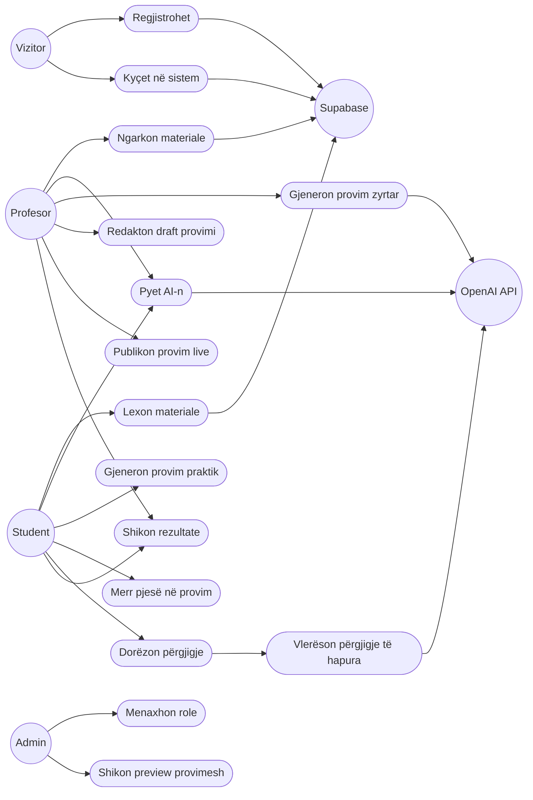
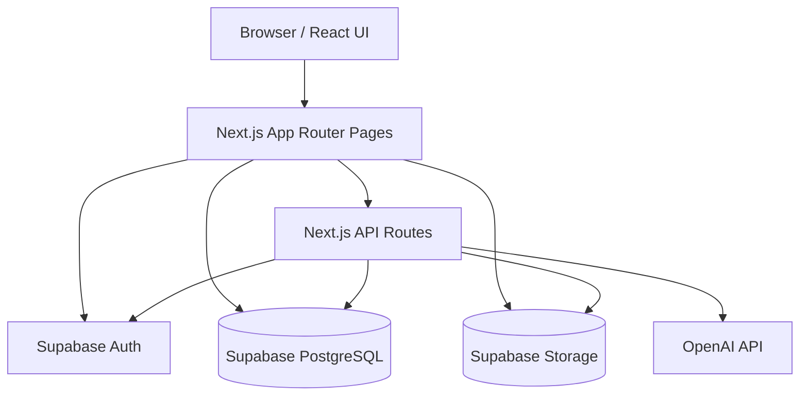
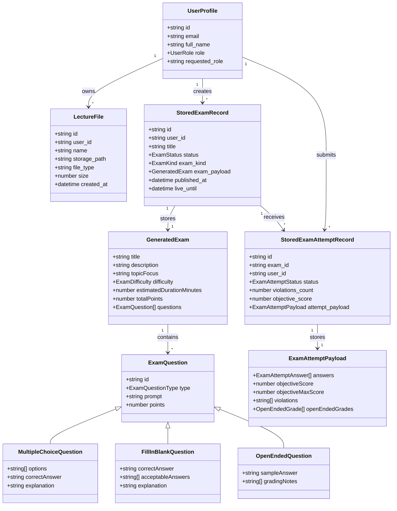
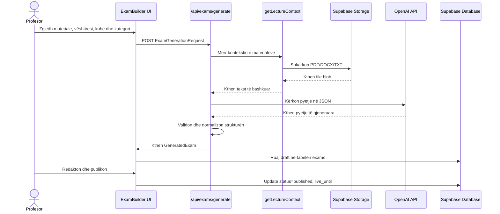
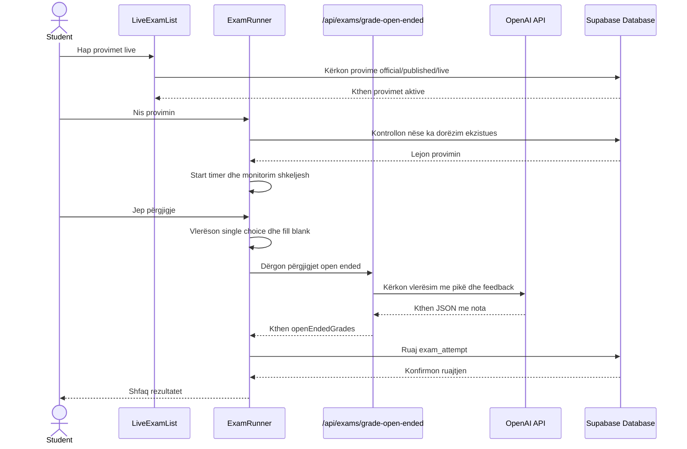
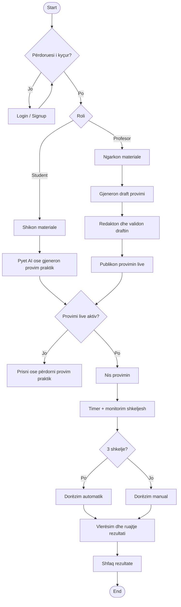
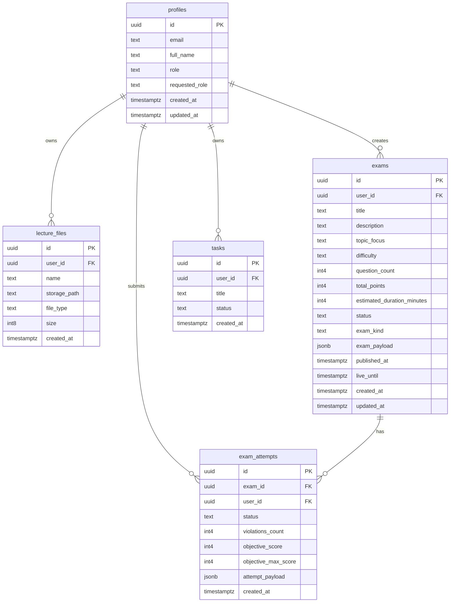

# Dokumentimi i Projektit: Smart Exam Mode

## 1. Faqja Ballore dhe Informacioni Bazë

**Titulli i projektit:** Smart Exam Mode  
**Studenti:** [Shëno emrin dhe mbiemrin]  
**Numri i indeksit:** [Shëno numrin e indeksit]  
**Lënda:** [Shëno emrin e lëndës]  
**Profesori/Asistenti:** [Shëno emrin e profesorit/asistentit]  
**Institucioni:** [Shëno institucionin/fakultetin]  
**Viti akademik:** 2025/2026  
**Teknologjitë kryesore:** Next.js, React, TypeScript, Supabase, OpenAI API, Tailwind CSS  
**Repository/Projekti:** `Smart-exam-mode`  
**URL publike:** https://smart-exam-mode.vercel.app/

## Tabela e Përmbajtjes

1. Faqja ballore dhe informacioni bazë
2. Abstrakti
3. Hyrja
4. Analiza e kërkesave
5. Dizajni i sistemit
6. Implementimi
7. Testimi
8. Udhëzuesi i përdorimit
9. Konkluzionet
10. Referencat

## 2. Abstrakti

Smart Exam Mode është një platformë web për menaxhimin e materialeve mësimore, asistencë me inteligjencë artificiale dhe organizim të provimeve online. Problemi kryesor që trajton projekti është shpërndarja e materialeve, pyetjeve, ushtrimeve dhe provimeve në shumë kanale të ndryshme, gjë që e bën procesin e studimit më të ngadalshëm dhe më pak të strukturuar. Sistemi ofron një hapësirë të vetme ku profesori mund të ngarkojë materiale, të gjenerojë provime zyrtare me AI, t'i publikojë në periudha të caktuara kohore dhe të analizojë rezultatet e studentëve. Studenti mund të lexojë materialet, të pyesë AI-n për sqarime, të krijojë provime praktike private dhe të marrë pjesë në provime live.

Zgjidhja është ndërtuar me Next.js App Router, React dhe TypeScript në frontend/backend, Supabase për autentikim, databazë, storage dhe politika sigurie RLS, si dhe OpenAI API për chat, gjenerim provimesh dhe vlerësim të pyetjeve të hapura. Rezultati është një aplikacion funksional me role të ndara për admin, profesor dhe student, me ruajtje të të dhënave në cloud, rrjedhë të kontrolluar provimi, detektim të shkeljeve gjatë provimit dhe rezultat të automatizuar.

## 3. Hyrja

### 3.1 Konteksti dhe motivimi i projektit

Në procesin akademik, studentët shpesh përdorin materiale të shpërndara në PDF, dokumente Word, shënime tekstuale, email-e ose platforma të ndryshme. Kjo krijon vështirësi në përgatitje, sidomos kur studenti duhet të gjejë shpejt informacionin e saktë ose të kontrollojë njohuritë përmes pyetjeve praktike. Nga ana tjetër, profesorët kanë nevojë për mënyrë më të shpejtë për të krijuar provime të strukturuara, për t'i publikuar ato vetëm gjatë një periudhe të caktuar dhe për të parë rezultatet e dorëzuara.

Smart Exam Mode është motivuar nga nevoja për një mjedis më të qartë dhe më të fokusuar: materialet, pyetjet, provimet, rezultatet dhe AI ndihmësi vendosen në një sistem të vetëm.

### 3.2 Problemi që zgjidhet

Projekti zgjidh këto probleme:

- mungesa e një hapësire të centralizuar për materiale mësimore;
- vështirësia për të krijuar provime të shpejta dhe të strukturuara;
- mungesa e provimeve praktike private për studentë;
- kontrolli i kufizuar gjatë provimeve online;
- mungesa e lidhjes direkte mes materialeve të lëndës dhe pyetjeve të provimit;
- nevoja për rezultate dhe feedback më të shpejtë pas dorëzimit.

### 3.3 Qëllimet dhe objektivat

Qëllimet kryesore të projektit janë:

- të krijohet një platformë moderne për përgatitje dhe menaxhim provimesh;
- të mbështeten role të ndryshme: admin, profesor dhe student;
- të mundësohet ngarkimi i materialeve PDF, DOCX dhe TXT;
- të përdoret AI për përgjigje të bazuara në materiale dhe për gjenerim provimesh;
- të krijohen provime zyrtare nga profesorët dhe provime praktike nga studentët;
- të realizohet provim live me timer dhe monitorim shkeljesh;
- të ruhen rezultatet dhe përgjigjet në Supabase;
- të sigurohet ndarje e të dhënave përmes Row Level Security.

### 3.4 Struktura e raportit

Raporti fillon me përmbledhjen dhe motivimin e projektit, pastaj analizon kërkesat funksionale dhe jo-funksionale. Më pas paraqitet dizajni i sistemit me diagramet UML dhe ER, skema e databazës dhe arkitektura teknike. Seksioni i implementimit shpjegon teknologjitë, strukturën e folderëve dhe pjesët kryesore të kodit. Në fund përfshihet strategjia e testimit, manuali i përdorimit, konkluzionet dhe referencat në format APA.

## 4. Analiza e Kërkesave

### 4.1 Aktorët e sistemit

| Aktori | Përshkrimi |
| --- | --- |
| Vizitor | Përdorues pa llogari, mund të shohë faqen hyrëse dhe të regjistrohet ose kyçet. |
| Student | Lexon materiale, pyet AI-n, krijon provime praktike, merr pjesë në provime live dhe sheh rezultatet. |
| Profesor | Ngarkon materiale, gjeneron provime zyrtare, redakton draftet, publikon provime live dhe analizon rezultatet. |
| Admin | Menaxhon rolet e përdoruesve, fshin llogari dhe shikon preview të provimeve zyrtare. |
| OpenAI API | Shërbim i jashtëm për chat, gjenerim pyetjesh dhe vlerësim të përgjigjeve të hapura. |
| Supabase | Shërbim për autentikim, databazë, storage dhe politika sigurie. |

### 4.2 Kërkesat funksionale

| ID | Kërkesa funksionale | Prioriteti | Implementimi në projekt |
| --- | --- | --- | --- |
| F-01 | Përdoruesi mund të regjistrohet me email, fjalëkalim, emër dhe rol të kërkuar. | I lartë | `app/signup/page.tsx`, `contexts/AuthContext.tsx`, `profiles` |
| F-02 | Përdoruesi mund të kyçet dhe të dalë nga sistemi. | I lartë | `app/login/page.tsx`, `AuthContext` |
| F-03 | Përdoruesi mund të rivendosë ose ndryshojë fjalëkalimin. | Mesatar | `forgot-password`, `reset-password`, `change-password` |
| F-04 | Admini mund të ndryshojë role: student, profesor, admin. | I lartë | `components/dashboard/AdminPanel.tsx`, `admin_set_user_role` |
| F-05 | Admini mund të fshijë përdorues dhe të dhënat e tyre. | I lartë | `admin_delete_user` në `supabase_setup.sql` |
| F-06 | Profesori mund të ngarkojë materiale PDF, DOCX dhe TXT deri në 10MB. | I lartë | `MaterialsCard`, Supabase Storage `lectures` |
| F-07 | Profesori mund të shohë, hapë preview dhe fshijë materialet e veta. | I lartë | `utils/lectureFiles.ts`, `MaterialsCard` |
| F-08 | Studenti mund të shohë materiale të ngarkuara nga profesorët. | I lartë | RLS policies në `lecture_files` dhe storage |
| F-09 | Përdoruesi mund të pyesë AI-n në modalitet të përgjithshëm. | Mesatar | `AIChatCard`, `/api/chat` |
| F-10 | Përdoruesi mund të pyesë AI-n duke zgjedhur një material specifik. | I lartë | `getLectureContext`, PDF/DOCX/TXT parsing |
| F-11 | Profesori mund të gjenerojë draft provimi zyrtar me AI. | I lartë | `/api/exams/generate`, `ExamBuilder` |
| F-12 | Studenti mund të gjenerojë provim praktik privat. | I lartë | `ExamBuilder`, tabela `exams` me `exam_kind='practice'` |
| F-13 | Provimi mund të konfigurohet me titull, fokus teme, vështirësi, kohë, materiale dhe kategori pyetjesh. | I lartë | `ExamGenerationRequest`, `DEFAULT_EXAM_SETTINGS` |
| F-14 | Sistemi mbështet pyetje single choice, fill in blank dhe open ended. | I lartë | `types/exams.ts`, `ExamRunner` |
| F-15 | Profesori mund të redaktojë draftin para publikimit. | I lartë | `ExamBuilder`, `normalizeDraftExam` |
| F-16 | Profesori mund ta publikojë provimin për një dritare kohore live. | I lartë | `published_at`, `live_until`, `handlePublishExam` |
| F-17 | Studenti mund të shohë vetëm provimet zyrtare live. | I lartë | `LiveExamList`, RLS në `exams` |
| F-18 | Studenti mund të hyjë në provim me timer dhe navigim pyetjesh. | I lartë | `ExamRunner` |
| F-19 | Sistemi regjistron shkelje gjatë provimit: tab switching, Escape, fullscreen exit, shortcuts. | I lartë | `ExamRunner`, `VIOLATION_LIMIT` |
| F-20 | Provimi dorëzohet automatikisht pas 3 shkeljeve. | I lartë | `submitExam('auto_submitted')` |
| F-21 | Pyetjet objektive vlerësohen automatikisht. | I lartë | `examGrading.ts`, `ExamRunner` |
| F-22 | Pyetjet e hapura vlerësohen nga AI me feedback. | I lartë | `/api/exams/grade-open-ended` |
| F-23 | Rezultatet ruhen dhe shfaqen për studentin. | I lartë | `exam_attempts`, `ExamBuilder` results view |
| F-24 | Profesori mund të analizojë dorëzimet e provimeve zyrtare. | I lartë | `ExamBuilder` results view |
| F-25 | Admini mund të shohë preview të provimeve zyrtare pa i nisur ato. | Mesatar | `AdminPanel` preview |
| F-26 | Përdoruesi mund të krijojë detyra studimi. | I ulët | `app/dashboard/tasks/page.tsx`, tabela `tasks` |

### 4.3 Kërkesat jo-funksionale

| ID | Kërkesa jo-funksionale | Realizimi |
| --- | --- | --- |
| NF-01 | Siguria | Supabase Auth, RLS policies, kontroll rolesh, ndarje e të dhënave sipas `auth.uid()`. |
| NF-02 | Privatësia | Studentët shohin provimet/rezultatet e veta; profesorët shohin vetëm rezultatet e provimeve që kanë krijuar. |
| NF-03 | Performanca | Next.js App Router, komponentë klient/server, query të kufizuara dhe indekse në `exams`, `exam_attempts`, `tasks`. |
| NF-04 | Shkallëzueshmëria | Supabase si backend i menaxhuar, ruajtje e file-ve në Storage, API routes të ndara. |
| NF-05 | Mirëmbajtshmëria | TypeScript, tipe të përbashkëta në `types/`, util functions në `utils/`, komponentë të ndarë. |
| NF-06 | Përdorshmëria | Dashboard sipas rolit, sidebar e përshtatur, UI me gjendje loading/error/success. |
| NF-07 | Besueshmëria | Validim i inputeve, fallback për mungesë file-sh, kontroll i formatit JSON nga AI. |
| NF-08 | Kufizimi i abuzimit | Maksimum 30 pyetje për gjenerim, maksimum 25 materiale të zgjedhura, maksimum 5 materiale në chat. |
| NF-09 | Portabiliteti | Mund të ekzekutohet lokalisht me `npm install` dhe `npm run dev`, ose në Vercel. |
| NF-10 | Testueshmëria | `npm run typecheck`, `npm run lint`, `npm run build` dhe test cases manuale. |

### 4.4 Use Case Diagram (UML)



### 4.5 User Stories

| ID | User story | Kriteri i pranimit |
| --- | --- | --- |
| US-01 | Si student, dua të krijoj llogari që të kem provimet dhe rezultatet e mia. | Pas regjistrimit krijohet profil me rol të kërkuar dhe përdoruesi mund të kyçet. |
| US-02 | Si profesor, dua të ngarkoj materiale që AI të mund të përdorë kontekstin e lëndës. | File ruhet në Supabase Storage dhe metadata ruhet në `lecture_files`. |
| US-03 | Si student, dua të pyes AI-n për një ligjëratë specifike. | Përgjigjja kthehet nga `/api/chat` dhe bazohet në tekstin e file-it të zgjedhur. |
| US-04 | Si profesor, dua të gjeneroj një provim zyrtar me pyetje të ndryshme. | Sistemi krijon draft me pyetje single choice, fill blank dhe open ended. |
| US-05 | Si profesor, dua të redaktoj draftin para publikimit. | Pyetjet mund të ndryshohen dhe drafti ruhet vetëm nëse është valid. |
| US-06 | Si profesor, dua të publikoj provimin vetëm për një periudhë të caktuar. | Provimi merr status `published` dhe fushën `live_until`. |
| US-07 | Si student, dua të shoh vetëm provimet live që janë aktive. | Lista tregon vetëm provimet zyrtare të publikuara me `live_until > now`. |
| US-08 | Si student, dua të kem timer dhe navigim në provim. | Provimi shfaq kohën e mbetur, pyetjet dhe butonat previous/next. |
| US-09 | Si sistem, dua të regjistroj shkeljet gjatë provimit. | Shkeljet ruhen në `attempt_payload.violations` dhe rritet `violations_count`. |
| US-10 | Si profesor, dua të analizoj rezultatet e studentëve. | Dorëzimet shfaqen të grupuara sipas provimit dhe studentit. |
| US-11 | Si admin, dua të aprovoj profesorë. | Roli ndryshohet përmes funksionit `admin_set_user_role`. |

## 5. Dizajni i Sistemit

### 5.1 Arkitektura e sistemit

Sistemi përdor arkitekturë web me frontend dhe backend të integruar në Next.js. Faqet dhe komponentët React paraqesin UI-n, ndërsa API routes të Next.js komunikojnë me OpenAI dhe Supabase. Supabase menaxhon identitetin e përdoruesve, databazën PostgreSQL, RLS policies dhe ruajtjen e file-ve. OpenAI përdoret vetëm nga server-side API routes, që API key të mos ekspozohet në browser.



### 5.2 Shtresat kryesore

| Shtresa | Përgjegjësia | Shembuj file-sh |
| --- | --- | --- |
| UI / Presentation | Faqet, dashboard-i, forma, tabela, pamje rezultate | `app/`, `components/dashboard/` |
| State/Auth | Ruajtja e user/session/profile/role në frontend | `contexts/AuthContext.tsx` |
| API Layer | Chat, gjenerim provimesh, vlerësim pyetjesh të hapura | `app/api/chat/route.ts`, `app/api/exams/*` |
| Domain Types | Modelet TypeScript për provime, pyetje, rezultate dhe role | `types/exams.ts`, `types/roles.ts` |
| Utilities | Supabase clients, file parsing, OpenAI client, grading helpers | `utils/` |
| Persistence | PostgreSQL tables, RLS, functions, indexes | `supabase_setup.sql` |

### 5.3 Class Diagram / Domain Model



### 5.4 Sequence Diagram: Gjenerimi dhe publikimi i provimit zyrtar



### 5.5 Sequence Diagram: Pjesëmarrja dhe dorëzimi i provimit live



### 5.6 Activity Diagram: Rrjedha kryesore e provimit



### 5.7 ER Diagram



### 5.8 Dizajni i bazës së të dhënave

| Tabela | Qëllimi | Fushat kryesore |
| --- | --- | --- |
| `profiles` | Ruajtja e profilit dhe rolit të përdoruesit | `id`, `email`, `full_name`, `role`, `requested_role` |
| `lecture_files` | Metadata për materialet e ngarkuara | `user_id`, `name`, `storage_path`, `file_type`, `size` |
| `exams` | Draftet, provimet praktike dhe provimet zyrtare | `exam_kind`, `status`, `exam_payload`, `live_until` |
| `exam_attempts` | Dorëzimet e studentëve dhe rezultatet | `exam_id`, `user_id`, `violations_count`, `attempt_payload` |
| `tasks` | Detyra të thjeshta studimi për përdoruesin | `title`, `status` |

Politikat RLS janë pjesë e dizajnit të sigurisë. Shembuj:

- përdoruesi sheh vetëm profilin e vet, ndërsa admini sheh profilet e të gjithëve;
- profesori menaxhon materialet dhe provimet e veta;
- studenti sheh materialet e profesorëve dhe provimet zyrtare që janë live;
- studenti mund të fusë attempt vetëm për provim praktik të vetin ose provim zyrtar të publikuar;
- provimet zyrtare kanë indeks unik opsional që pengon më shumë se një dorëzim për student.

## 6. Implementimi

### 6.1 Teknologjitë dhe gjuhët e përdorura

| Teknologjia | Përdorimi në projekt |
| --- | --- |
| Next.js 16 App Router | Faqe, routing, API routes dhe build production. |
| React 19 | Komponentët e UI-së dhe menaxhimi i state-it në frontend. |
| TypeScript | Tipizim statik për modele, props, API payloads dhe utilities. |
| Supabase Auth | Regjistrim, kyçje, reset password dhe menaxhim session-i. |
| Supabase PostgreSQL | Ruajtja e profileve, materialeve, provimeve, rezultateve dhe task-eve. |
| Supabase Storage | Ruajtja e file-ve PDF/DOCX/TXT në bucket `lectures`. |
| OpenAI SDK | Chat, gjenerim provimesh dhe vlerësim pyetjesh të hapura. |
| Tailwind CSS | Stilizimi i UI-së dhe responsive layout. |
| pdf-parse | Nxjerrja e tekstit nga PDF. |
| mammoth | Nxjerrja e tekstit nga DOCX. |
| lucide-react | Ikonat në ndërfaqe. |

### 6.2 Struktura e folderëve dhe moduleve

```text
app/
  api/
    chat/route.ts                      API për AI chat
    exams/generate/route.ts            API për gjenerim provimesh
    exams/grade-open-ended/route.ts     API për vlerësim pyetjesh të hapura
  dashboard/                           Faqet e dashboard-it sipas roleve
  exam/[id]/page.tsx                   Faqja e provimit live/praktik
  login, signup, forgot-password       Faqet e autentikimit

components/
  dashboard/                           Komponentët kryesorë të dashboard-it
  auth/                                UI për login/signup/reset
  i18n/                                Locale hook

contexts/
  AuthContext.tsx                      Session, user, profile dhe role state

types/
  exams.ts                             Modelet e provimeve dhe pyetjeve
  roles.ts                             Modelet e roleve dhe profileve

utils/
  supabase/                            Supabase clients për browser/server
  openai.ts                            Inicializimi i OpenAI client
  fileParsing.ts                       Leximi i materialeve PDF/DOCX/TXT
  lectureFiles.ts                      CRUD dhe signed URLs për materiale
  examGrading.ts                       Normalizim dhe kontroll përgjigjesh

supabase_setup.sql                     Skema, funksionet, RLS dhe indekset
```

### 6.3 Shpjegimi i pjesëve kryesore të kodit

**Autentikimi dhe rolet:** `AuthContext.tsx` merr session-in nga Supabase, lexon profilin nga tabela `profiles`, normalizon rolin dhe e bën të qasshëm për gjithë dashboard-in. Kjo lejon që sidebar-i, faqet dhe query-t të ndryshojnë sipas rolit.

**Ngarkimi i materialeve:** `MaterialsCard.tsx` pranon vetëm PDF, DOCX dhe TXT, kontrollon madhësinë deri në 10MB, e ngarkon file-in në Supabase Storage dhe ruan metadata në `lecture_files`. `lectureFiles.ts` krijon preview links, liston materialet dhe pastron rreshtat e vjetër nëse file-i nuk ekziston më në Storage.

**Leximi i materialeve për AI:** `fileParsing.ts` shkarkon file-in nga Storage, e kthen në buffer dhe nxjerr tekstin me `pdf-parse`, `mammoth` ose `buffer.toString('utf-8')`. Teksti bashkohet me emrin e burimit dhe kufizohet në 25,000 karaktere për të shmangur kërkesa shumë të mëdha.

**AI Chat:** `/api/chat/route.ts` pranon mesazhin, modalitetin `general` ose `lecture`, merr kontekstin e materialit nëse duhet dhe dërgon prompt në OpenAI. Përgjigjja kthehet në UI nga `AIChatCard.tsx`.

**Gjenerimi i provimit:** `/api/exams/generate/route.ts` validon inputet, kufizon titullin, fokusin, numrin e materialeve dhe numrin maksimal të pyetjeve. Pyetjet gjenerohen në batch sipas kategorisë dhe ruhen në strukturë JSON të normalizuar. Nëse AI kthen më pak pyetje se duhet, hidhet `ExamShapeError`.

**Redaktimi dhe publikimi:** `ExamBuilder.tsx` i lejon profesorit ta redaktojë draftin. Funksioni `normalizeDraftExam` siguron që çdo pyetje të ketë tekst, pikë, përgjigje të saktë dhe opsione valide para ruajtjes.

**Provimi live:** `ExamRunner.tsx` ngarkon provimin, llogarit kohën e mbetur, ndalon disa shortcut-e, regjistron shkeljet dhe pas shkeljes së tretë dorëzon provimin automatikisht. Vetëm studentët mund të nisin attempt real; profesorët/adminët kanë preview-only.

**Vlerësimi:** Pyetjet `multiple_choice` krahasohen me përgjigjen e saktë pas normalizimit të tekstit. Pyetjet `fill_in_blank` përdorin `isFillInAnswerCorrect`, që pranon variante të përgjigjeve. Pyetjet `open_ended` dërgohen te `/api/exams/grade-open-ended`, ku OpenAI kthen pikë dhe feedback.

**Siguria në databazë:** `supabase_setup.sql` krijon tabela, funksione `SECURITY DEFINER`, politika RLS dhe indekse. RLS është pjesë kritike sepse klienti përdor Supabase nga browser-i dhe qasja duhet të kufizohet direkt në databazë.

### 6.4 Sfidat teknike dhe zgjidhjet

| Sfida | Zgjidhja e implementuar |
| --- | --- |
| AI mund të kthejë JSON jo të plotë ose pyetje të përsëritura. | U shtua `extractJson`, normalizim i pyetjeve, kontroll i tipit, batch generation dhe deduplikim me prompt key. |
| Materialet në Storage mund të mos përputhen me rreshtat në databazë. | `filterExistingStorageFiles` provon path-e alternative dhe fshin rreshta stale. |
| Studentët nuk duhet të shohin provime joaktive. | Query dhe RLS filtrojnë `exam_kind='official'`, `status='published'`, `live_until > now()`. |
| Provimi live kërkon kontroll bazik kundër largimit nga faqja. | `ExamRunner` monitoron Escape, fullscreen exit, tab focus/visibility dhe shortcut-e të caktuara. |
| Përgjigjet e shkurtra mund të shkruhen me variante të ndryshme. | `normalizeAnswerText` heq shkronjat me diakritikë, simbolet dhe hapësirat e tepërta. |
| Pyetjet e hapura nuk mund të vlerësohen vetëm me krahasim tekstual. | U përdor OpenAI për partial credit dhe feedback të shkurtër. |
| Admini duhet të ndryshojë role pa ekspozuar service key në frontend. | U përdorën funksione PostgreSQL `SECURITY DEFINER` me kontroll roli. |

## 7. Testimi

### 7.1 Strategjia e testimit

Testimi i projektit ndahet në tri nivele:

- **Testim statik:** TypeScript type checking dhe ESLint për gabime sintaksore, tipe jo të sakta dhe probleme kualiteti.
- **Testim build:** `next build` për të verifikuar që projekti kompilohet dhe routet gjenerohen.
- **Testim manual/funksional:** rrjedha reale për regjistrim, role, materiale, AI chat, gjenerim provimi, provim live dhe rezultate.

### 7.2 Rezultatet e komandave teknike

| Komanda | Qëllimi | Rezultati |
| --- | --- | --- |
| `npm run typecheck` | Kontroll i TypeScript me `tsc --noEmit` | Kaloi me sukses |
| `npm run lint` | Kontroll ESLint në gjithë projektin | Kaloi me sukses |
| `npm run build` | Build production me Next.js | Kaloi me sukses, 22 faqe statike/dinamike të gjeneruara |

### 7.3 Test cases dhe rezultatet

Tabela më poshtë paraqet skenarët manualë që duhet të verifikohen në një ambient me Supabase dhe `OPENAI_API_KEY` të konfiguruar. Statusi “Pritet të kalojë” bazohet në implementimin aktual dhe plotësohet me evidencë gjatë testimit praktik me llogari reale.

| ID | Test case | Hapat | Rezultati i pritur | Statusi |
| --- | --- | --- | --- | --- |
| TC-01 | Regjistrim studenti | Hap `/signup`, plotëso formën me rol Student | Krijohet llogari dhe profili merr `requested_role='student'` | Pritet të kalojë |
| TC-02 | Regjistrim profesori | Hap `/signup`, zgjidh Professor | Profili krijohet si student me kërkesë profesori derisa admini ta aprovojë | Pritet të kalojë |
| TC-03 | Login valid | Hap `/login`, fut email/password valid | Përdoruesi ridrejtohet në `/dashboard` | Pritet të kalojë |
| TC-04 | Login invalid | Fut kredenciale gabim | Shfaqet mesazh gabimi | Pritet të kalojë |
| TC-05 | Ndryshim roli nga admini | Admin hap `/dashboard/admin` dhe zgjedh rol | Funksioni `admin_set_user_role` përditëson profilin | Pritet të kalojë |
| TC-06 | Upload PDF/DOCX/TXT | Profesor hap Lectures dhe ngarkon file valid | File ruhet në Storage dhe `lecture_files` | Pritet të kalojë |
| TC-07 | Refuzim file i pavlefshëm | Ngarko format tjetër ose mbi 10MB | Shfaqet gabim dhe file nuk ruhet | Pritet të kalojë |
| TC-08 | AI chat me material | Zgjidh ligjëratë dhe bëj pyetje | API merr kontekstin dhe kthen përgjigje | Pritet të kalojë me `OPENAI_API_KEY` valid |
| TC-09 | Gjenerim provimi zyrtar | Profesor zgjedh materiale/kategori dhe gjeneron | Krijohet draft me pyetje të strukturuara | Pritet të kalojë me `OPENAI_API_KEY` valid |
| TC-10 | Validim drafti | Hiq përgjigjen e saktë ose prompt-in | Sistemi ndalon ruajtjen e draftit invalid | Pritet të kalojë |
| TC-11 | Publikim live | Profesor publikon provimin | `status='published'`, `live_until` vendoset | Pritet të kalojë |
| TC-12 | Lista e provimeve live | Student hap `/dashboard/live-exams` | Shfaqen vetëm provimet aktive | Pritet të kalojë |
| TC-13 | Provim me timer | Student nis provimin | Shfaqet countdown dhe navigimi pyetjeve | Pritet të kalojë |
| TC-14 | Shkelje gjatë provimit | Shtyp Escape ose ndërro tab | Shkelja regjistrohet | Pritet të kalojë |
| TC-15 | Auto submit | Arrin 3 shkelje | Provimi dorëzohet automatikisht me status `auto_submitted` | Pritet të kalojë |
| TC-16 | Vlerësimi objektiv | Jep përgjigje MCQ/fill blank | Pikët llogariten automatikisht | Pritet të kalojë |
| TC-17 | Vlerësimi open-ended | Jep përgjigje tekstuale | AI kthen pikë dhe feedback | Pritet të kalojë me `OPENAI_API_KEY` valid |
| TC-18 | Rezultatet e studentit | Hap `/dashboard/results` | Shfaqet attempt, pikët, shkeljet dhe review | Pritet të kalojë |
| TC-19 | Rezultatet e profesorit | Profesor hap Results | Shfaqen dorëzimet e provimeve zyrtare të tij | Pritet të kalojë |
| TC-20 | Preview admin | Admin hap `/dashboard/admin/previews` | Shfaq provimet zyrtare pa nisur attempt | Pritet të kalojë |

### 7.4 Bug-e/rreziqe të gjetura dhe si janë korrigjuar

| Problemi | Ndikimi | Korrigjimi |
| --- | --- | --- |
| Rreshtat e materialeve mund të mbeten në DB edhe kur file mungon në Storage. | AI nuk mund të lexojë materialin. | `filterExistingStorageFiles` verifikon signed URL dhe pastron rreshtat stale. |
| AI mund të kthejë pyetje me format të gabuar. | Draft provimi jo valid. | `sanitizeQuestion`, `normalizeQuestionType`, `response_format: json_object`. |
| Studentët mund të tentojnë më shumë se një attempt në provim zyrtar. | Rezultate të dyfishta. | Kontroll në UI/API dhe indeks unik për attempt zyrtar në SQL. |
| Përgjigjet e shkurtra me hapësira/simbole mund të dalin gabim. | Vlerësim i padrejtë. | Normalizim me `normalizeAnswerText`. |
| Nëse tabela `exam_attempts` mungon, UI mund të dështojë. | Dorëzim i provimit nuk ruhet. | Ka fallback mesazhesh për setup missing dhe njoftim për Supabase SQL. |

## 8. Udhëzuesi i Përdorimit (User Manual)

### 8.1 Instalimi dhe konfigurimi lokal

**Parakushtet:**

- Node.js i instaluar;
- npm i instaluar;
- projekt Supabase me databazë dhe Storage;
- OpenAI API key.

**Hapat e instalimit:**

1. Klono ose hape projektin:

```bash
git clone https://github.com/fnebihi10/Smart-exam-mode.git
cd Smart-exam-mode
```

2. Instalo varësitë:

```bash
npm install
```

3. Krijo `.env.local` duke u bazuar në `.env.example`:

```env
NEXT_PUBLIC_SUPABASE_URL=your_supabase_project_url
NEXT_PUBLIC_SUPABASE_ANON_KEY=your_supabase_anon_key
OPENAI_API_KEY=your_openai_api_key
OPENAI_EXAM_MODEL=gpt-4o-mini
OPENAI_CHAT_MODEL=gpt-4o-mini
```

4. Ekzekuto SQL-in në `supabase_setup.sql` në Supabase SQL Editor. Ky script krijon:

- `profiles`;
- `lecture_files`;
- `exams`;
- `exam_attempts`;
- `tasks`;
- RLS policies;
- funksionet për role/admin;
- indekset për performancë.

5. Krijo bucket-in `lectures` në Supabase Storage dhe sigurohu që policies për leximin e materialeve janë aktive.

6. Nise aplikacionin lokalisht:

```bash
npm run dev
```

7. Hape aplikacionin në browser:

```text
http://localhost:3000
```

### 8.2 Si përdoret aplikacioni

#### 8.2.1 Regjistrimi dhe kyçja

1. Hape faqen kryesore.
2. Kliko `Create account`.
3. Plotëso emrin, email-in, fjalëkalimin dhe zgjidh rolin Student ose Professor.
4. Pas verifikimit të email-it, kthehu te `Sign in`.
5. Kyçu me email dhe fjalëkalim.

**Screenshot i rekomanduar për raport:**  
Figura 1 - Faqja kryesore / landing page.  
Figura 2 - Forma e regjistrimit.  
Figura 3 - Forma e kyçjes.

#### 8.2.2 Përdorimi si admin

1. Admini hap `/dashboard/admin`.
2. Shikon listën e profileve.
3. Ndryshon rolin e përdoruesit në Student, Professor ose Admin.
4. Nëse duhet, fshin përdoruesin dhe të dhënat e tij.
5. Në `/dashboard/admin/previews` sheh preview të provimeve zyrtare.

**Screenshot i rekomanduar për raport:**  
Figura 4 - Admin control: menaxhimi i roleve.  
Figura 5 - Admin preview: provimet zyrtare.

#### 8.2.3 Përdorimi si profesor

1. Profesorit i aprovohet roli nga admini.
2. Hap `Dashboard -> Lectures`.
3. Ngarkon materiale PDF, DOCX ose TXT.
4. Hap `Dashboard -> AI Chat` për pyetje rreth materialeve.
5. Hap `Dashboard -> Exams`.
6. Zgjedh materialet, vështirësinë, kohën dhe numrin e pyetjeve.
7. Klikon `Generate draft`.
8. Kontrollon dhe redakton pyetjet.
9. Klikon `Publish live` dhe cakton dritaren kohore.
10. Pas dorëzimeve, hap `Results` për të parë rezultatet e studentëve.

**Screenshot i rekomanduar për raport:**  
Figura 6 - Lectures: lista dhe upload-i i materialeve.  
Figura 7 - AI Chat me material të zgjedhur.  
Figura 8 - Exam setup dhe gjenerimi i draftit.  
Figura 9 - Redaktimi/preview i draft provimit.  
Figura 10 - Publikimi live dhe lista e provimeve zyrtare.  
Figura 11 - Rezultatet e studentëve për profesorin.

#### 8.2.4 Përdorimi si student

1. Studenti kyçet në dashboard.
2. Hap `Lectures` dhe shikon materialet e profesorëve.
3. Hap `AI Chat` dhe zgjedh materialin për të bërë pyetje.
4. Hap `Practice` për të gjeneruar provim praktik privat.
5. Hap `Live exams` për të parë provimet zyrtare aktive.
6. Klikon `Join exam`.
7. Lexon rregullat dhe nis provimin.
8. Jep përgjigje për pyetjet single choice, fill blank dhe open ended.
9. Dorëzon provimin ose sistemi e dorëzon automatikisht nëse arrihen 3 shkelje.
10. Hap `Results` për të parë pikët, përgjigjet e sakta dhe feedback-un.

**Screenshot i rekomanduar për raport:**  
Figura 12 - Dashboard i studentit.  
Figura 13 - Lista e provimeve live.  
Figura 14 - Pamja e provimit me timer.  
Figura 15 - Paralajmërimi për shkelje.  
Figura 16 - Rezultati dhe answer review.

### 8.3 Lista e screenshot-eve për vendosje në dokument final

Nëse dokumenti eksportohet në Word/PDF, rekomandohet të vendosen screenshot-et në këtë rend:

| Figura | Përmbajtja | Vendndodhja e rekomanduar |
| --- | --- | --- |
| 1 | Faqja kryesore | Pas seksionit 8.2.1 |
| 2 | Signup | Pas seksionit 8.2.1 |
| 3 | Login | Pas seksionit 8.2.1 |
| 4 | Admin role management | Pas seksionit 8.2.2 |
| 5 | Admin exam previews | Pas seksionit 8.2.2 |
| 6 | Upload/materiale | Pas seksionit 8.2.3 |
| 7 | AI Chat | Pas seksionit 8.2.3 |
| 8 | Exam Builder | Pas seksionit 8.2.3 |
| 9 | Draft preview/edit | Pas seksionit 8.2.3 |
| 10 | Live official exams | Pas seksionit 8.2.4 |
| 11 | Exam Runner | Pas seksionit 8.2.4 |
| 12 | Results review | Pas seksionit 8.2.4 |

## 9. Konkluzionet

### 9.1 Çfarë u arrit

Projekti realizon një platformë funksionale për përgatitje dhe menaxhim provimesh online. U arrit integrimi i materialeve mësimore me AI, gjenerimi i provimeve të strukturuara, publikimi i provimeve zyrtare live, vlerësimi automatik i përgjigjeve dhe ruajtja e rezultateve. Sistemi ndan qartë përgjegjësitë sipas roleve dhe përdor Supabase RLS për kontroll të qasjes në të dhëna.

### 9.2 Kufizimet e projektit

- Monitorimi i shkeljeve në browser është bazik dhe nuk mund të garantojë siguri të plotë kundër çdo manipulimi.
- Vlerësimi i pyetjeve të hapura varet nga cilësia dhe disponueshmëria e OpenAI API.
- Nuk ka test suite të automatizuar unit/integration në repository; aktualisht verifikimi mbështetet në typecheck, lint, build dhe testim manual.
- Sistemi nuk përfshin ende panel të avancuar analitik me grafikë të detajuar për performancën afatgjatë.
- Për materialet shumë të gjata, konteksti shkurtohet në 25,000 karaktere.

### 9.3 Sugjerime për zhvillim të mëtejshëm

- Shtimi i testimeve automatike me Jest/Vitest dhe Playwright.
- Raporte analitike më të avancuara për studentë dhe profesorë.
- Rubrika më të detajuara për vlerësimin e pyetjeve të hapura.
- Export i provimeve dhe rezultateve në PDF/CSV.
- Sistem njoftimesh për provime live dhe rezultate të reja.
- Versionim i materialeve dhe lidhje e çdo pyetjeje me burimin konkret.
- Integrim me LMS universitare.
- Përmirësim i proctoring me verifikim identiteti ose video-monitorim, nëse kërkohet nga institucioni.

## 10. Referencat

OpenAI. (n.d.). *Libraries - OpenAI API*. Retrieved May 20, 2026, from https://platform.openai.com/docs/libraries/javascript

React. (n.d.). *React reference overview*. Retrieved May 20, 2026, from https://react.dev/reference/react

Supabase. (n.d.). *Auth*. Retrieved May 20, 2026, from https://supabase.com/docs/guides/auth

Supabase. (n.d.). *Row Level Security*. Retrieved May 20, 2026, from https://supabase.com/docs/guides/database/postgres/row-level-security

Tailwind Labs. (n.d.). *Tailwind CSS documentation*. Retrieved May 20, 2026, from https://tailwindcss.com/docs

The TypeScript Team. (n.d.). *The TypeScript handbook*. Retrieved May 20, 2026, from https://www.typescriptlang.org/docs/handbook/intro.html

Vercel. (n.d.). *Next.js App Router documentation*. Retrieved May 20, 2026, from https://nextjs.org/docs/app

Lucide. (n.d.). *Lucide React guide*. Retrieved May 20, 2026, from https://lucide.dev/guide/react
